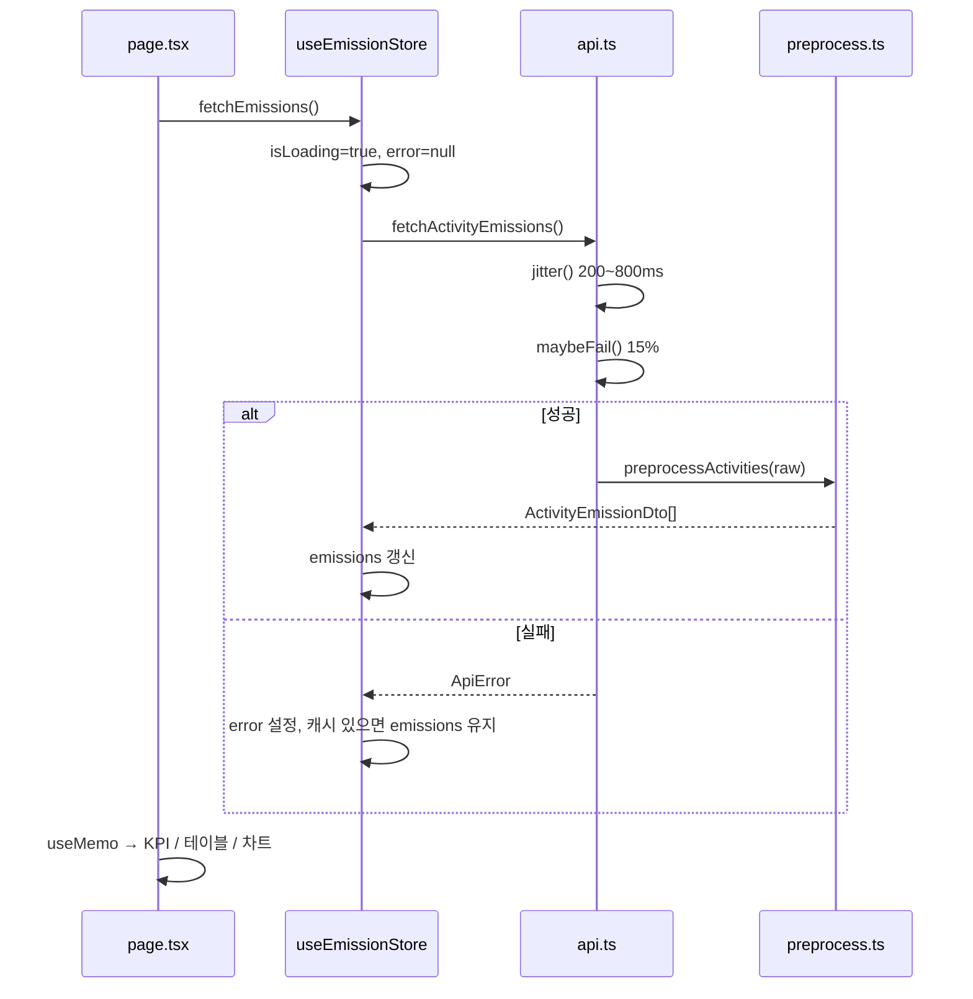
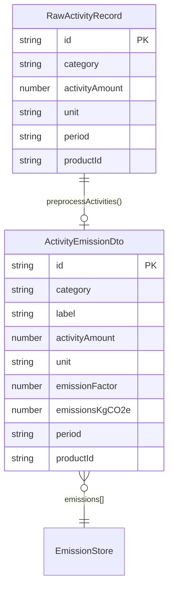

# HanaLoop PCF Dashboard

**제품 탄소 발자국(Product Carbon Footprint)** 활동 데이터를 수집·계산·시각화하는 프론트엔드 대시보드입니다.  
Next.js 14 App Router, TypeScript, Tailwind CSS, Zustand, Recharts로 구현했으며, Mock API 불안정성과 CSV 즉시 임포트까지 실무형 UX를 목표로 설계했습니다.

---

## 질문 및 가정 사항 (Assumptions)

과제 착수 전 아래와 같이 범위와 동작을 가정하고 구현했습니다.

- **데이터 출처**: 별도 백엔드 서버는 없으며, `src/lib/api.ts`의 Mock API가 초기 활동 데이터를 제공합니다. CSV 업로드는 서버 전송 없이 브라우저 내 파싱·전처리 후 Zustand 스토어에 반영합니다.
- **배출량 계산**: `wiki.md` 및 과제 명세의 공식 `활동 데이터량 × 배출계수 = 탄소 배출량(kgCO₂e)`만 사용하며, Scope 3 세분화·LCA 단계별 가중치 등은 범위 외입니다.
- **활동 유형 그룹**: KPI·차트의 «전기 / 원소재 / 운송» 3분류는 `plastic_raw_1`, `plastic_raw_2`를 «원소재»로 합산합니다.
- **CSV 양식**: 과제용 엑셀은 **CSV UTF-8(쉼표 구분)** 로 저장해 업로드한다고 가정합니다. `.xlsx` 바이너리 파싱은 추가 라이브러리 없이 의도적으로 제외했습니다.
- **필터 상태**: 기간·카테고리 필터는 URL 쿼리가 아닌 `page.tsx` 로컬 상태로 관리합니다. 새로고침 시 필터는 초기화되지만, Mock/CSV로 적재된 `emissions`는 API 재호출 전까지 스토어에 유지됩니다.
- **반응형 레이아웃**: `lg` 브레이크포인트 기준으로 사이드바 고정·2열 패널(테이블 | 차트)을 전환하며, 그 미만에서는 Navigation Drawer(오버레이)로 동작합니다.

---

## 아키텍처 개요

### 레이어 구조

```
┌─────────────────────────────────────────────────────────────┐
│  Presentation (src/app/page.tsx, src/components/dashboard)  │
├─────────────────────────────────────────────────────────────┤
│  Client State (src/store/useEmissionStore.ts — Zustand)     │
├─────────────────────────────────────────────────────────────┤
│  Domain / IO                                                │
│  · api.ts          — Mock fetch + jitter / maybeFail        │
│  · preprocess.ts   — Raw → ActivityEmissionDto              │
│  · parse-activity-csv.ts — CSV → RawActivityRecord          │
│  · emission-stats.ts — 필터·KPI·차트 집계 (순수 함수)         │
├─────────────────────────────────────────────────────────────┤
│  Types (src/lib/types.ts)                                   │
└─────────────────────────────────────────────────────────────┘
```

### 상태 경계 (State Boundaries)

| 경계 | 소유 위치 | 책임 | 비고 |
|------|-----------|------|------|
| **서버/원격 데이터** | `api.ts` (Mock) | 지연·실패 시뮬레이션, Raw 배열 반환 | React 외부, Promise 기반 |
| **정제된 도메인 데이터** | `useEmissionStore.emissions` | `ActivityEmissionDto[]` 단일 소스 | 차트·KPI·테이블이 공유 |
| **비동기 UI 상태** | `useEmissionStore` | `isLoading`, `error` | API fetch 전용 |
| **뷰 필터** | `page.tsx` `useState` | `periodFilter`, `categoryFilter` | 파생 데이터만 변경, 스토어 미침범 |
| **레이아웃/UI** | `page.tsx`, 컴포넌트 | 사이드바 열림, 드래그 상태 등 | 도메인과 분리 |
| **CSV 파싱 피드백** | `CsvUploader` 로컬 | `parseError`, `successMessage` | 스토어 `uploadCsvData` throw → catch |

### 데이터 흐름

#### 1) 초기 로드 (Mock API)



#### 2) CSV 임포트 (가산점)

```mermaid
flowchart LR
  A[CSV 파일] --> B[FileReader UTF-8]
  B --> C[parseActivityCsv]
  C --> D[RawActivityRecord[]]
  D --> E[preprocessActivities]
  E --> F[ActivityEmissionDto[]]
  F --> G{uploadCsvData mode}
  G -->|prepend| H[imported + 기존 emissions]
  G -->|replace| I[imported만]
  H --> J[Zustand emissions]
  I --> J
  J --> K[KPI · Table · Chart 즉시 반영]
```

#### 3) 화면 파생 데이터 (읽기 전용)

```
emissions (store)
    → filterEmissions(period, category)   [useMemo]
        → computeKpiSummary()            [useMemo]
        → computeChartSlices()           [useMemo]
        → ActivityTable rows
```

---

## 주요 기능

| 영역 | 구현 |
|------|------|
| Mock API | `jitter()` 200~800ms, `maybeFail()` 15% 실패, `ApiError` |
| 대시보드 레이아웃 | Navigation Drawer + KPI / 테이블 / Pie·Bar 차트 |
| 로딩·에러 UX | Skeleton(초기 로드), Error Banner + Retry, stale-while-revalidate |
| CSV 임포트 | 드래그앤드롭·클릭, prepend/replace, 행 단위 검증 메시지 |

---

## 렌더링 효율성 (Rendering Efficiency)

불필요한 리렌더를 줄이기 위해 다음을 적용했습니다.

### 1. Zustand `useShallow` — 구독 범위 최소화

`page.tsx`와 `CsvUploader.tsx`에서 스토어 전체가 아닌 필요한 슬라이스만 구독합니다. 객체 선택자를 쓸 때 참조 동일성 비교로 **슬라이스 내부 값이 바뀔 때만** 리렌더됩니다.

```ts
const { emissions, isLoading, error, fetchEmissions } = useEmissionStore(
  useShallow((state) => ({
    emissions: state.emissions,
    isLoading: state.isLoading,
    error: state.error,
    fetchEmissions: state.fetchEmissions,
  })),
);
```

### 2. `useMemo` — 파생 데이터 메모이제이션

`emissions` 또는 필터가 바뀔 때만 `filteredEmissions` → `kpi` → `chartSlices` → `periods`를 재계산합니다. Recharts·테이블에 넘기는 배열 참조가 안정적으로 유지됩니다.

### 3. `React.memo` — 프레젠테이션 컴포넌트 고정

`KpiSummary`, `ActivityTable`, `EmissionsChart`는 props가 동일하면 리렌더를 건너뜁니다. 상태·핸들러는 `page.tsx`에만 두어 **데이터 흐름은 단방향**으로 유지했습니다.

### 4. 순수 집계 함수 분리 (`emission-stats.ts`)

KPI·차트 계산을 React 밖 순수 함수로 두어, 동일 입력에 대한 결과를 예측 가능하게 하고 컴포넌트 내부 연산 부담을 줄였습니다.

### 5. (향후) Recharts 코드 스플리팅

현재 `page.tsx`가 Client Component라 Recharts가 초기 번들에 포함됩니다(~200kB대). 프로덕션 확장 시 `next/dynamic`으로 `EmissionsChart`만 lazy load하는 여지를 남겨 두었습니다.

---

## 설계 Trade-off 및 숏컷

제한된 시간 안에서 «동작하는 완성도»와 «UX»의 균형을 위해 아래 선택을 했습니다.

### 1. Mock API 실패 시 stale-while-revalidate 캐시 유지

- **선택**: `fetchEmissions` 실패 시, 이전에 성공한 `emissions`가 있으면 **배열을 비우지 않음**. Error Banner + «다시 시도»만 노출.
- **이유**: 15% 실패 확률에서 매번 빈 화면·Skeleton이 반복되면 데모·채점 체험이 급격히 나빠짐.
- **대가**: 실패 직후 화면 데이터가 «마지막 성공 스냅샷»일 수 있어, 엄밀한 실시간성은 포기. 헤더 «데이터 갱신 중…»으로 재요청 중임을 표시.

### 2. 순수 TypeScript CSV 파서 (xlsx 라이브러리 미사용)

- **선택**: `parse-activity-csv.ts`에서 따옴표·쉼표·BOM·한글 헤더 alias를 직접 처리. `.xlsx`는 «CSV UTF-8로 저장» 안내.
- **이유**: MUI/Ant Design 금지와 같이 **의존성·번들 최소화**가 과제 취지에 부합. 활동 데이터 행 수가 적어 클라이언트 파싱으로 충분.
- **대가**: Excel 네이티브 업로드 불가, 복잡한 다중 시트·수식 셀 미지원.

### 3. 필터는 URL이 아닌 로컬 state

- **선택**: `periodFilter`, `categoryFilter`를 `page.tsx` `useState`로 관리.
- **이유**: 공유 가능한 딥링크보다 **구현 단순성·리렌더 범위 축소** 우선.
- **대가**: 새로고침 시 필터 초기화.

### 4. CSV 업로드는 API 우회·스토어 직접 적재

- **선택**: `uploadCsvData`가 Mock 서버 없이 `preprocessActivities` 후 `emissions` 갱신.
- **이유**: «가공 없이 업로드 → 즉시 대시보드 반영» 가산점 요구에 가장 직접적으로 부합.
- **대가**: 업로드 데이터와 Mock API 원본의 영구 동기화·충돌 해결 로직은 미구현(prepend/replace로 사용자가 선택).

---

## 데이터 모델 (ERD / 스키마)

프론트엔드 단일 저장소이므로 DB 테이블 대신 **도메인 타입** 관계를 ERD로 표현했습니다.



**배출계수 (requirements.md)**

| category | unit | emissionFactor (kgCO₂e) |
|----------|------|-------------------------|
| electricity | kWh | 0.456 |
| plastic_raw_1 | kg | 2.3 |
| plastic_raw_2 | kg | 3.2 |
| transport_truck | ton-km | 3.5 |

---

## Docker Compose를 활용한 실행법 (1단계)

> Node.js 설치 없이 컨테이너만으로 실행합니다. (Docker Desktop 또는 Docker Engine + Compose v2 필요)

```bash
docker compose up --build
```

브라우저에서 [http://localhost:3000](http://localhost:3000) 접속.

| 항목 | 내용 |
|------|------|
| 포트 | `3000:3000` |
| 이미지 | `node:20-alpine` Multi-stage (`deps` → `builder` → `runner`) |
| 번들 | Next.js `output: "standalone"` — 런타임에 `node_modules` 미포함 |
| 볼륨 | `./public` → `/app/public` (읽기 전용, 샘플 CSV 교체용) |

백그라운드 실행: `docker compose up --build -d`  
종료: `docker compose down`

---

## 로컬 실행 가이드 (5단계)

> **요구 사항**: Node.js 18.17 이상 권장

### npm (기본)

| 단계 | 명령 / 행동 |
|:----:|-------------|
| **1** | 저장소 클론 또는 압축 해제 후 프로젝트 루트로 이동 |
| **2** | `npm install` — 의존성 설치 |
| **3** | `npm run dev` — 개발 서버 기동 (또는 아래 프로덕션 경로) |
| **4** | 브라우저에서 [http://localhost:3000](http://localhost:3000) 접속 |
| **5** | (선택) `public/sample-activity-data.csv`를 업로드 영역에 드래그하여 CSV 임포트 확인 |

```bash
cd hanaloop-dashboard
npm install
npm run dev
```

### yarn (체크리스트 호환 — `yarn start`)

```bash
cd hanaloop-dashboard
corepack enable          # Node 18+ 내장 Yarn 활성화 (최초 1회)
yarn install
yarn build
yarn start               # http://localhost:3000
```

개발 모드: `yarn dev`

**추가 스크립트**

| 명령 | 설명 |
|------|------|
| `npm run build` / `yarn build` | 프로덕션 빌드·타입 검사 |
| `npm run start` / `yarn start` | 빌드 결과 실행 |
| `npm run lint` / `yarn lint` | ESLint |
| `npm test` / `yarn test` | Vitest 단위·통합 검증 (21 tests) |

**채점 시 확인 포인트**

1. 첫 로드: 200~800ms 지연 후 KPI·차트 표시 (Skeleton 가능).
2. «다시 시도»: Mock 15% 실패 시에도, 한 번 성공 후에는 차트 유지 + 에러 배너.
3. CSV: `sample-activity-data.csv` 업로드 → KPI·테이블·차트 즉시 갱신.

---

## UI 실행 가이드 (스크린샷 · 영상)

체크리스트의 «UI 실행 과정 안내» 항목용입니다. 제출 전 `docs/screenshots/`에 아래 화면을 캡처하거나 짧은 데모 영상을 첨부해 주세요.

| # | 캡처 대상 | 확인 내용 |
|---|-----------|-----------|
| 1 | 대시보드 전체 | Navigation Drawer + KPI + 테이블 + 차트 |
| 2 | 초기 Skeleton | Mock API 첫 로드 시 shimmer |
| 3 | Error Banner + «다시 시도» | Mock 15% 실패 후 캐시 유지 UX |
| 4 | CSV 업로드 성공 | `sample-activity-data.csv` 드래그 후 KPI 갱신 |
| 5 | CSV 오류 메시지 | 잘못된 양식 업로드 시 amber 경고 배너 |

> 영상·이미지 파일은 용량 관리를 위해 Git LFS 또는 제출 링크(드라이브 등)로 제공할 수 있습니다.

---

## 자동화 테스트 (기능 검증)

```bash
npm test
# 또는: yarn test
```

| 테스트 파일 | 검증 항목 |
|-------------|-----------|
| `preprocess.test.ts` | PCF 공식 (110×0.456=50.16), 단위·라벨·배출계수 |
| `parse-activity-csv.test.ts` | CSV 파싱, 한글 헤더, 오류 입력 시 `CsvParseError` |
| `emission-stats.test.ts` | KPI 합산, `kgCO₂e` 단위 표시, 필터 |
| `useEmissionStore.test.ts` | CSV prepend/replace, 잘못된 CSV 시 상태 불변 |
| `api.test.ts` | `jitter` / `maybeFail` 시뮬레이션 |

---

## CSV 양식 (가산점)

헤더 예시 (영문):

```csv
id,category,activityAmount,unit,period,productId
upload-001,electricity,50,kWh,2024-Q3,PCF-C
```

- **category**: `electricity`, `plastic_raw_1`, `plastic_raw_2`, `transport_truck` 또는 한글 라벨(전기, 원소재 플라스틱 1 등).
- **unit**: 카테고리별 기본 단위(kWh / kg / ton-km). 생략 시 자동 적용.
- **모드**: «기존 데이터 앞에 추가»(prepend) / «전체 교체»(replace).

---

## AI 에이전트 활용 기록

호진님 실무 조언에 따라 **«계획 선보고 → 승인 후 구현»** 방식으로 Cursor Agent를 단계별로 사용했습니다. `agent.md`에 정의한 원칙을 그대로 따랐습니다.

| 단계 | 프롬프트·산출물 요약 | 에이전트 역할 |
|------|---------------------|---------------|
| **0. 컨텍스트 고정** | `requirements.md`, `wiki.md`, `agent.md`를 @멘션으로 매 턴 첨부 | 도메인·제약(Next 14, Tailwind only, MUI 금지) 재주입 |
| **1. Mock & 도메인** | «`jitter`/`maybeFail`, `preprocess` 분리, `api.ts` 계획 먼저» | `types` / `preprocess` / `api` 초안 + Trade-off 설명 |
| **2. 상태 관리** | «Zustand `fetchEmissions`, 15% 실패 시 캐시 유지» | `useEmissionStore` + shallow 구독 패턴 제안 |
| **3. 대시보드 UI** | «Drawer + KPI/테이블/차트, Skeleton·Error Banner» | 컴포넌트 분리·`useMemo`/`memo` 적용 |
| **4. CSV 가산점** | «순수 TS 파서, `uploadCsvData`, 드래그앤드롭» | `parse-activity-csv.ts`, `CsvUploader` |
| **5. 제출 문서** | «채점용 README, Assumptions·아키텍처·라이선스» | 본 문서 |

**프롬프트 조율 원칙**

- 한 번에 전체 구현을 요청하지 않고, **파일 단위·기능 단위**로 쪼개어 리뷰 가능한 diff 크기 유지.
- «구현 계획을 먼저 설명해줘»를 반복해, 에이전트가 바로 코드를 쏟지 않도록 통제.
- Trade-off(캐시 유지, CSV 파서 직접 구현 등)를 **의도적으로 남기도록** 요청해 README에 근거로 기록.

---

## 디렉터리 구조

```
src/
├── app/
│   ├── page.tsx          # 대시보드 오케스트레이션 (Client)
│   ├── layout.tsx
│   └── globals.css       # skeleton-shimmer
├── components/
│   ├── dashboard/        # Sidebar, KPI, Table, Chart, CsvUploader, …
│   └── ui/               # Skeleton
├── lib/
│   ├── api.ts            # Mock API
│   ├── preprocess.ts     # 배출량 계산 · DTO 변환
│   ├── parse-activity-csv.ts
│   ├── emission-stats.ts # 필터 · KPI · 차트 집계
│   └── types.ts
└── store/
    └── useEmissionStore.ts
docs/
└── openapi.json          # OpenAPI 3.0 Mock API 명세
public/
└── sample-activity-data.csv
```

---

## 오픈소스 라이선스

본 프로젝트는 아래 패키지에 의존합니다. 상세 조건은 각 프로젝트의 LICENSE를 따릅니다.

| 패키지 | 버전(대략) | 용도 | 라이선스 |
|--------|------------|------|----------|
| [Next.js](https://github.com/vercel/next.js) | 14.2.x | App Router, 빌드 | MIT |
| [React](https://github.com/facebook/react) | 18.x | UI | MIT |
| [TypeScript](https://github.com/microsoft/TypeScript) | 5.x | 정적 타입 | Apache-2.0 |
| [Tailwind CSS](https://github.com/tailwindlabs/tailwindcss) | 3.4.x | 스타일링 | MIT |
| [Zustand](https://github.com/pmndrs/zustand) | 5.x | 클라이언트 상태 | MIT |
| [Recharts](https://github.com/recharts/recharts) | 3.x | Pie/Bar 차트 | MIT |
| [swagger-ui-react](https://github.com/swagger-api/swagger-ui) | 5.x | `/api-docs` Swagger UI | Apache-2.0 |
| [ESLint](https://github.com/eslint/eslint) | 8.x | 린트 (dev) | MIT |

**폰트**: `layout.tsx`의 Geist(local font)는 Vercel 배포 템플릿 기본 리소스를 사용합니다.

---

## OpenAPI (Swagger) 명세 안내

| 항목 | 내용 |
|------|------|
| **명세 파일** | [`docs/openapi.json`](docs/openapi.json) |
| **OpenAPI 버전** | 3.0.3 |
| **논리 Base URL** | `http://localhost:3000/api/v1` (클라이언트 Mock; 실제 HTTP 라우트 없음) |

### 엔드포인트 ↔ 클라이언트 함수

| Method | Path | `operationId` | 클라이언트 구현 |
|--------|------|---------------|-----------------|
| `GET` | `/activities/raw` | `fetchRawActivities` | `src/lib/api.ts` → `fetchRawActivities()` |
| `GET` | `/activities/emissions` | `fetchActivityEmissions` | `src/lib/api.ts` → `fetchActivityEmissions()` → `useEmissionStore.fetchEmissions()` |

### Schema Components (`components.schemas`)

| 스키마 | 용도 |
|--------|------|
| `ActivityCategory` | `electricity`, `plastic_raw_1`, `plastic_raw_2`, `transport_truck` |
| `ActivityUnit` | `kWh`, `kg`, `ton-km` |
| `EmissionFactorMap` | 카테고리별 배출계수 (0.456 / 2.3 / 3.2 / 3.5) |
| `RawActivityRecord` | 원본 활동 데이터 (배출량 없음) |
| `ActivityEmissionDto` | 전처리 DTO (`emissionFactor`, `emissionsKgCO2e`, `label` 포함) |
| `ApiError` | 15% Mock 실패 응답 (`503` + `name`/`message`) |

### 브라우저 Swagger UI (내장)

개발·평가 시 앱을 실행한 뒤 아래 주소로 접속합니다.

| URL | 설명 |
|-----|------|
| [http://localhost:3000/api-docs](http://localhost:3000/api-docs) | Swagger UI 전용 페이지 |
| [http://localhost:3000/swagger](http://localhost:3000/swagger) | `/api-docs`로 리다이렉트 |

```bash
npm install          # swagger-ui-react 포함
npm run dev
```

명세 원본: `docs/openapi.json` (페이지에서 동일 파일 import)

### Swagger Editor / Postman에서 불러오기

1. [Swagger Editor](https://editor.swagger.io/) → **File → Import file** → `docs/openapi.json`
2. Postman → **Import** → `docs/openapi.json` → Collection 생성

> CSV·엑셀 업로드는 브라우저 로컬 파싱이며 REST API 범위 밖입니다.

---

## 참고 문서 (과제 번들)

- `requirements.md` — 기능·Mock API·배출계수 명세
- `wiki.md` — PCF·탄소 배출량 계산 공식
- `agent.md` — AI 에이전트 개발 지침

---

## 체크리스트 자가 점검 (`checklist.md` 대응)

| 항목 | 상태 | 근거 |
|------|:----:|------|
| PCF 계산 결과 시각화 | ✅ | KPI 카드 + Pie/Bar 차트 + 활동 테이블 |
| 데이터 정확성·단위 표시 | ✅ | `formatKgCO2e`, 테이블 `활동량 + unit`, Vitest 21건 통과 |
| 오류 입력 시 에러 메시지 | ✅ | CSV `CsvUploader` 경고, Mock API `ErrorBanner` |
| README 로컬 실행 5단계 | ✅ | npm·yarn 절차 병기 |
| README AI 도구 기록 | ✅ | «AI 에이전트 활용 기록» 절 |
| README 시스템·설계 | ✅ | 아키텍처·상태 경계·Trade-off |
| README ERD/다이어그램 | ✅ | Mermaid ERD + 시퀀스·플로우 |
| UI 실행 가이드(캡처·영상) | ⚠️ | README 안내표 제공 — **제출자가 스크린샷/영상 첨부 필요** |
| GitHub public·커밋 | ⚠️ | **제출자가 저장소 공개·push 필요** |
| 엑셀/CSV 임포트 (보너스) | ✅ | `FileUploader` + CSV·엑셀 파서 |
| Docker Compose (보너스) | ✅ | `docker compose up --build` → :3000 |
| OpenAPI 명세 (보너스) | ✅ | `docs/openapi.json` — Swagger/Postman Import |

---

**제출자 메모**: 본 README는 채점관이 **가정 → 구조 → 효율 → Trade-off → 실행 → 테스트 → AI 활용 → 라이선스** 순으로 한 번에 파악할 수 있도록 구성했습니다. 추가 질문이나 실행 이슈가 있으면 `npm run build` / `npm test` 로그와 함께 공유해 주시면 됩니다.
