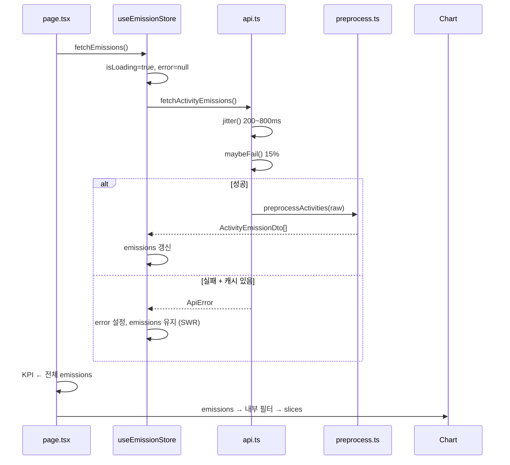
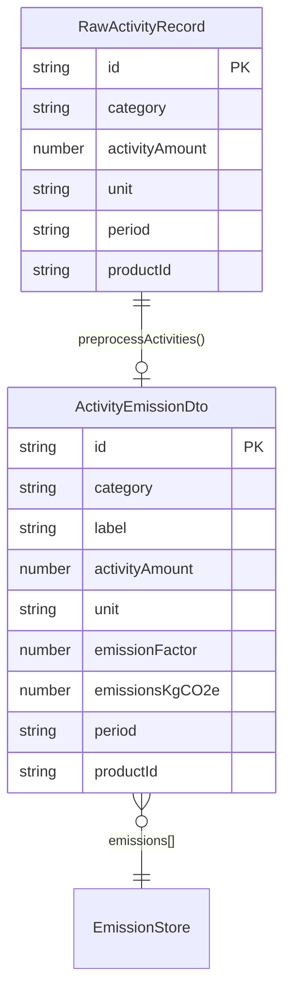

# HanaLoop PCF Dashboard

**제품 탄소 발자국(Product Carbon Footprint)** 활동 데이터를 수집·계산·시각화하는 프론트엔드 대시보드입니다.  
Next.js 14 App Router, TypeScript, Tailwind CSS, Zustand, Recharts로 구현했으며, **경영진용 거시 KPI**와 **분석가용 세부 필터·임포트**를 동시에 만족하는 실무형 UX를 목표로 설계했습니다.

---

## 채점 루브릭 대응 요약

| 평가 축 (가중치)         | 본 구현에서의 근거                                                                                             |
| ------------------------ | -------------------------------------------------------------------------------------------------------------- |
| **Creativity (25%)**     | CSV·엑셀·수동 입력 3채널 임포트 통합, KPI·차트 필터 분리 전략, 사이드바/탭 이중 내비게이션, Empty State 세분화 |
| **UI/UX (25%)**          | Drawer + Sticky 사이드바, Skeleton·Error Banner(SWR), 차트 고정 높이(CLS 방지), 임포트 탭·인라인 검증 메시지   |
| **UI Engineering (20%)** | `lg` 반응형, `aria-*`·키보드 접근, 독립 스크롤 영역, 로딩 시 `aria-busy`                                       |
| **SW Engineering (20%)** | Zustand 단일 소스, 임포트 파이프라인 분리, Vitest 32건, Docker/OpenAPI 보너스                                  |
| **Code Quality (10%)**   | 순수 집계(`emission-stats.ts`), 공유 파서(`parse-activity-rows.ts`), `useShallow`·`memo`·`useMemo`             |

---

## 질문 및 가정 사항 (Assumptions)

과제 착수 전·고도화 단계에서 아래와 같이 **도메인 범위**와 **동작 정책**을 가정하고 구현했습니다.

### 데이터 출처·계산

- **백엔드**: 별도 서버 없음. `src/lib/api.ts` Mock API가 초기 Raw 데이터를 제공하며, **CSV·엑셀·수동 입력**은 Mock을 우회해 브라우저 내 파싱·전처리 후 Zustand에 직접 적재합니다.
- **PCF 공식**: `wiki.md`·명세의 `활동 데이터량 × 배출계수 = 탄소 배출량(kgCO₂e)`만 사용. Scope 3 세분화·LCA 단계 가중치는 범위 외.
- **활동 그룹**: KPI·차트의 «전기 / 원소재 / 운송» 3분류는 `plastic_raw_1`, `plastic_raw_2`를 «원소재»로 합산합니다.

### 임포트·파싱 범위

| 채널                  | 가정                                                                                                                              | 미지원(의도적)                       |
| --------------------- | --------------------------------------------------------------------------------------------------------------------------------- | ------------------------------------ |
| **CSV**               | UTF-8, 쉼표 구분. 한글/영문 헤더 alias. 순수 TypeScript 파서.                                                                     | TSV, 고정폭, 멀티 GB 파일            |
| **엑셀 (.xlsx/.xls)** | 과제용 «과제용 데이터» 시트 — 상단 설명·참고표 행 스킵, **키워드 점수 기반 헤더 행 탐지**, `활동 유형`+`설명`으로 원소재 1/2 구분 | 다중 시트 병합, 수식 셀, 매크로      |
| **수동 입력**         | 단건 `RawActivityRecord` — ID는 `manual-{uuid}` 자동 부여, `preprocessActivities` 후 prepend/replace                              | 일괄 편집 그리드, 서버 트랜잭션·롤백 |

> **엑셀 구현 메모**: 바이너리 디코딩만 `xlsx`(SheetJS)에 위임하고, 헤더 탐지·행 필터·카테고리 매핑·DTO 검증은 **저장소 내 순수 TypeScript**(`parse-activity-excel.ts` → `parse-activity-rows.ts`)로 처리합니다. UI 라이브러리(MUI 등)는 사용하지 않습니다.

### KPI·차트 필터 전략 (경영진 대시보드)

- **KPI 카드**: `emissions` **전체** 기준 고정 — 거시적 누적 배출량·3대 그룹 합계를 항상 노출.
- **EmissionsChart**: 컴포넌트 **내부** `period` / `category` 필터 — 차트 뷰만 부분 인터랙티브.
- **활동 데이터 탭**: `page.tsx` 로컬 필터 → `ActivityTable` 전용 (차트 필터와 **독립**).
- **URL 동기화 없음**: 새로고침 시 필터 초기화, 스토어 `emissions`는 유지.

### 레이아웃·반응형

- `lg` 이상: 사이드바 `sticky top-0 h-screen`, 메인 콘텐츠만 스크롤.
- `lg` 미만: Navigation Drawer(오버레이). 사이드바 하단 **컴팩트 파일 업로더** 고정.
- 대시보드 본문: `ActivityImportPanel`(파일·수동 탭) + KPI + 차트.

---

## 아키텍처 개요

### 레이어 구조

```
┌──────────────────────────────────────────────────────────────────┐
│  Presentation                                                     │
│  · page.tsx — 탭(dashboard|activities), 테이블 필터, KPI 오케스트레이션 │
│  · ActivityImportPanel — 파일 | 수동 입력 탭                       │
│  · ManualInputForm / FileUploader / EmissionsChart(내장 필터)      │
│  · Sidebar — sticky 레이아웃 + compact FileUploader               │
├──────────────────────────────────────────────────────────────────┤
│  Client State (useEmissionStore — Zustand)                        │
│  · emissions, isLoading, error                                    │
│  · fetchEmissions | uploadCsvData | uploadExcelData | addManualActivity │
├──────────────────────────────────────────────────────────────────┤
│  Domain / IO (순수·비동기 분리)                                    │
│  · api.ts              — Mock fetch + jitter / maybeFail          │
│  · preprocess.ts       — Raw → ActivityEmissionDto (PCF 계산)     │
│  · parse-activity-csv.ts   — CSV → Raw[] (순수 TS)                │
│  · parse-activity-excel.ts — xlsx 디코드 + 헤더/행 TS 로직         │
│  · parse-activity-rows.ts  — CSV/Excel 공통 검증·카테고리 해석      │
│  · emission-stats.ts     — filterEmissions, KPI, chart slices     │
├──────────────────────────────────────────────────────────────────┤
│  Types (types.ts)                                                 │
└──────────────────────────────────────────────────────────────────┘
```

### 상태 경계 (State Boundaries)

| 경계                 | 소유 위치                          | 책임                               | 비고                       |
| -------------------- | ---------------------------------- | ---------------------------------- | -------------------------- |
| **서버/원격 데이터** | `api.ts`                           | 지연·15% 실패 시뮬레이션, Raw 반환 | React 외부 Promise         |
| **정제 도메인 SSOT** | `useEmissionStore.emissions`       | `ActivityEmissionDto[]`            | KPI·차트·테이블 공유 원본  |
| **비동기 UI**        | `useEmissionStore`                 | `isLoading`, `error`               | `fetchEmissions` 전용      |
| **테이블 필터**      | `page.tsx` `useState`              | `periodFilter`, `categoryFilter`   | 활동 데이터 탭만           |
| **차트 필터**        | `EmissionsChart` `useState`        | 기간·카테고리                      | KPI와 분리                 |
| **임포트 UI**        | `FileUploader` / `ManualInputForm` | parse 에러, 성공 토스트            | throw → catch, 스토어 액션 |
| **레이아웃**         | `page.tsx`, `Sidebar`              | drawer open, `activeTab`           | 도메인 무관                |

### 데이터 흐름

#### 1) 초기 로드 (Mock API)



#### 2) 임포트 파이프라인 (CSV / Excel / Manual)

```mermaid
flowchart TB
  subgraph inputs [입력 채널]
    CSV[CSV UTF-8]
    XLS[.xlsx / .xls]
    MAN[ManualInputForm]
  end

  subgraph parse [파싱·검증]
    PCSV[parseActivityCsv]
    PXL[parseActivityExcel<br/>헤더 점수·참고표 스킵]
    PROWS[parseActivityRows<br/>공통 검증]
  end

  CSV --> PCSV --> PROWS
  XLS --> PXL --> PROWS
  MAN -->|Omit id, store가 ID 부여| RAW[RawActivityRecord[]]

  PROWS --> RAW
  RAW --> PRE[preprocessActivities]
  PRE --> DTO[ActivityEmissionDto[]]
  DTO --> MODE{prepend / replace}
  MODE --> STORE[(Zustand emissions)]
  STORE --> KPI[KpiSummary 전체]
  STORE --> CHART[EmissionsChart 필터 후 집계]
  STORE --> TABLE[ActivityTable 탭 필터]
```

#### 3) 화면 파생 데이터 (읽기 전용·필터 분리)

```
emissions (store)
├── computeKpiSummary(emissions)           → KpiSummary (전체, page useMemo)
├── EmissionsChart
│     ├── filterEmissions(chartPeriod, chartCategory)  [내부 useMemo]
│     └── computeChartSlices(filtered)                 [내부 useMemo]
└── activities 탭
      └── filterEmissions(pagePeriod, pageCategory)    [page useMemo]
            └── ActivityTable rows
```

---

## 주요 기능 명세

| 영역                         | 구현                                                       | 핵심 파일                                   |
| ---------------------------- | ---------------------------------------------------------- | ------------------------------------------- |
| Mock API                     | `jitter` 200~800ms, `maybeFail` 15%, `ApiError`, SWR 캐시  | `api.ts`, `useEmissionStore.ts`             |
| 대시보드 레이아웃            | Drawer + **Sticky 사이드바** + 탭(대시보드 \| 활동 데이터) | `Sidebar.tsx`, `page.tsx`                   |
| KPI (거시)                   | 전체 누적 + 전기/원소재/운송 3카드                         | `KpiSummary.tsx`, `emission-stats.ts`       |
| **차트 독립 필터**           | 기간·카테고리 select, Empty State 2종                      | `EmissionsChart.tsx`                        |
| 활동 테이블                  | 기간·카테고리 필터, `kgCO₂e` 포맷                          | `ActivityTable.tsx`                         |
| **CSV 임포트**               | DnD·prepend/replace, 순수 TS 파서                          | `FileUploader.tsx`, `parse-activity-csv.ts` |
| **엑셀 임포트 (보너스)**     | 과제용 양식 헤더 탐지, 원소재 1/2 매핑                     | `parse-activity-excel.ts`                   |
| **수동 입력 (Manual Input)** | 활동 유형·량·기간·제품 ID, 단위 자동 표시                  | `ManualInputForm.tsx`, `addManualActivity`  |
| **임포트 통합 UI**           | 파일 \| 수동 입력 탭                                       | `ActivityImportPanel.tsx`                   |
| 로딩·에러 UX                 | Skeleton, Error Banner + Retry, 차트 `aria-busy`           | `DashboardSkeleton`, `ErrorBanner`          |
| OpenAPI (보너스)             | `docs/openapi.json`, `/api-docs` Swagger UI                | `app/api-docs/page.tsx`                     |
| Docker (보너스)              | Multi-stage, `standalone`                                  | `Dockerfile`, `docker-compose.yml`          |

---

## 렌더링 효율성 (Rendering Efficiency)

불필요한 리렌더·레이아웃 시프트를 줄이기 위해 다음을 적용했습니다.

### 1. Zustand `useShallow` — 구독 범위 최소화

`page.tsx`, `FileUploader`, `ManualInputForm` 등에서 스토어 **슬라이스만** 구독합니다. 선택 객체의 필드가 바뀔 때만 리렌더됩니다.

```ts
const { emissions, isLoading, error, fetchEmissions } = useEmissionStore(
  useShallow((state) => ({
    emissions: state.emissions,
    isLoading: state.isLoading,
    error: state.error,
    fetchEmissions: state.fetchEmissions,
  })),
);
```

### 2. `useMemo` — 파생 데이터·필터 메모이제이션

| 위치             | 메모 대상                                     | 트리거                          |
| ---------------- | --------------------------------------------- | ------------------------------- |
| `page.tsx`       | `periods`, `filteredEmissions`(테이블), `kpi` | `emissions`, 페이지 필터        |
| `EmissionsChart` | `filteredEmissions`, `slices`                 | `emissions`, **차트 전용** 필터 |

Recharts에 전달하는 `slices` 참조가 안정되어 **차트 필터 변경 시에만** 차트 subtree가 갱신됩니다.

### 3. `React.memo` + 단방향 데이터 흐름

`KpiSummary`, `ActivityTable`, `EmissionsChart`는 props 동일 시 리렌더 스킵.  
**필터 상태는 소비 컴포넌트에 근접 배치**(차트 필터 → `EmissionsChart` 내부)해 `page.tsx` 리렌더 파급을 줄였습니다.

### 4. 순수 집계 함수 (`emission-stats.ts`)

`filterEmissions`, `computeKpiSummary`, `computeChartSlices`, `getUniquePeriods` / `getUniqueCategories`를 React 밖 순수 함수로 분리해 Vitest로 **계산 정확성**과 **리렌더 비용**을 동시에 관리합니다.

### 5. CLS 방지 — 차트·스켈레톤 고정 치수

| 요소                  | 치수                                  | 목적                                     |
| --------------------- | ------------------------------------- | ---------------------------------------- |
| `EmissionsChart` 섹션 | `min-h-[420px]`                       | 필터·Empty State 전환 시 세로 점프 방지  |
| Pie/Bar 플롯          | `height: 256px` (`CHART_PLOT_HEIGHT`) | Recharts `ResponsiveContainer` 영역 고정 |
| `ChartSkeleton`       | 동일 플롯 높이                        | 로딩 ↔ 차트 전환 시 shimmer만 교체       |

`isAnimationActive={false}`로 Recharts 애니메이션으로 인한 추가 리플로우도 억제했습니다.

### 6. (향후) Recharts 코드 스플리팅

Client Component 특성상 Recharts가 초기 번들에 포함됩니다(~200kB대). 확장 시 `next/dynamic`으로 `EmissionsChart`만 lazy load할 수 있도록 컴포넌트 경계를 유지했습니다.

---

## 설계 Trade-off 및 숏컷

제한된 시간 안에서 **동작하는 완성도**, **번들 크기**, **경영진 UX**의 균형을 위해 아래를 선택했습니다.

### 1. Mock API 15% 실패 → stale-while-revalidate

- **선택**: `fetchEmissions` 실패 시 기존 `emissions`가 있으면 **비우지 않음**. Error Banner + «다시 시도».
- **이유**: 데모·채점 중 연속 빈 화면·Skeleton 반복 방지.
- **대가**: 실패 직후 데이터는 «마지막 성공 스냅샷». 헤더 «데이터 갱신 중…»으로 재요청 표시.

### 2. 임포트 파이프라인 — API 우회·스토어 직접 적재

- **선택**: CSV/Excel/Manual 모두 `preprocessActivities` → `applyImportedRecords(prepend|replace)`.
- **이유**: «가공 없이 업로드 → 즉시 대시보드 반영» 요구에 직접 부합.
- **대가**: Mock 원본과 업로드 데이터의 영구 동기화·충돌 해결은 사용자 모드 선택에 위임.

### 3. 파서 의존성 — CSV 순수 TS, Excel은 SheetJS 최소 사용

- **선택**: CSV는 **의존성 없는** `parse-activity-csv.ts`. Excel은 **바이너리 읽기만** `xlsx`, 도메인 로직은 in-repo TS.
- **이유**: MUI/Ant Design 금지와 같이 UI·파서 **번들 최소화**; 과제 행 수준에서는 클라이언트 처리로 충분.
- **대가**: `.xls` 구형·대용량·복잡 통합문서는 미지원. CSV UTF-8 권장 안내 유지.

### 4. KPI vs 차트 필터 분리

- **선택**: KPI = 전체, 차트 = 독립 필터, 테이블 = 페이지 필터.
- **이유**: 경영진은 «총량» 고정 인사이트, 분석은 차트/테이블에서 드릴다운.
- **대가**: 동일 화면에서 KPI 숫자와 차트 합계가 다를 수 있음 → Empty State 문구로 의도 명확화.

### 5. 필터·탭 상태 — URL 미동기화

- **선택**: `useState` 로컬 관리.
- **이유**: 구현 단순성·리렌더 범위 축소.
- **대가**: 새로고침 시 필터·탭 초기화.

### 6. 사이드바 레이아웃 — 스크롤 영역 분리 + Sticky

- **선택**: `h-screen flex flex-col`, `nav`에 `flex-1 min-h-0 overflow-y-auto`, 하단 `FileUploader`는 `shrink-0 mt-auto`, 데스크톱 `lg:sticky lg:top-0`.
- **이유**: 메뉴 증가·뷰포트 축소 시에도 **빠른 파일 임포트**가 항상 하단에 노출; 메인 스크롤과 사이드바 분리.
- **대가**: `lg` 미만에서는 Drawer로 전환, 풀 임포트 UI는 대시보드 `ActivityImportPanel` 사용.

---

## 데이터 모델 (ERD / 스키마)

프론트엔드 단일 저장소이므로 **도메인 타입** 관계를 ERD로 표현했습니다.



**배출계수 (`requirements.md`)**

| category        | unit   | emissionFactor (kgCO₂e) |
| --------------- | ------ | ----------------------- |
| electricity     | kWh    | 0.456                   |
| plastic_raw_1   | kg     | 2.3                     |
| plastic_raw_2   | kg     | 3.2                     |
| transport_truck | ton-km | 3.5                     |

---

## Docker Compose 실행 (보너스)

> Node.js 없이 컨테이너만으로 실행 (Docker Desktop / Compose v2)

```bash
docker compose up --build
```

브라우저: [http://localhost:3000](http://localhost:3000)

| 항목   | 내용                                                         |
| ------ | ------------------------------------------------------------ |
| 포트   | `3000:3000`                                                  |
| 이미지 | `node:20-alpine` Multi-stage (`deps` → `builder` → `runner`) |
| 번들   | Next.js `output: "standalone"`                               |
| 볼륨   | `./public` → `/app/public` (읽기 전용)                       |

백그라운드: `docker compose up --build -d` · 종료: `docker compose down`

---

## 로컬 실행 가이드 (5단계)

> **요구**: Node.js 18.17+

### npm

| 단계  | 명령 / 행동                                                             |
| :---: | ----------------------------------------------------------------------- |
| **1** | 저장소 클론 후 프로젝트 루트 이동                                       |
| **2** | `npm install`                                                           |
| **3** | `npm run dev` (또는 `npm run build` → `npm start`)                      |
| **4** | [http://localhost:3000](http://localhost:3000) 접속                     |
| **5** | `public/sample-activity-data.csv` 업로드 · 수동 입력 · 엑셀 임포트 확인 |

```bash
cd hanaloop-dashboard
npm install
npm run dev
```

### yarn (`yarn start` 호환)

```bash
corepack enable
yarn install
yarn build
yarn start
```

| 명령            | 설명                    |
| --------------- | ----------------------- |
| `npm run build` | 프로덕션 빌드·타입 검사 |
| `npm test`      | Vitest (**32 tests**)   |
| `npm run lint`  | ESLint                  |

### 채점 시 확인 포인트

1. **초기 로드**: 200~800ms 지연, Skeleton → KPI(전체) + 차트.
2. **Mock 실패**: 15% 실패 후에도 캐시 유지 + Error Banner + Retry.
3. **임포트**: CSV / 과제용 `.xlsx` / 수동 입력 → KPI·차트·테이블 즉시 반영.
4. **차트 필터**: 기간·카테고리 변경 → KPI 불변, 차트만 변경; 무매칭 시 안내 문구.
5. **사이드바**: 메인 스크롤 시 사이드바 고정, nav만 내부 스크롤.

---

## 자동화 테스트 (기능 검증)

```bash
npm test
```

**Vitest 4** · `src/**/*.test.ts` · **32 tests** (6 files)

| 테스트 파일                    | 검증 항목                                                 |
| ------------------------------ | --------------------------------------------------------- |
| `preprocess.test.ts`           | PCF 공식 (110×0.456=50.16), 단위·라벨·배출계수            |
| `parse-activity-csv.test.ts`   | CSV 파싱, 한글 헤더, `ActivityParseError`                 |
| `parse-activity-excel.test.ts` | 헤더 점수, 과제용 양식, 참고표 스킵, 원소재 매핑          |
| `emission-stats.test.ts`       | KPI 합산, 필터, `computeChartSlices`                      |
| `useEmissionStore.test.ts`     | CSV/Excel/Manual prepend·replace, 잘못된 CSV 시 상태 불변 |
| `api.test.ts`                  | `jitter` / `maybeFail`                                    |

---

## 임포트 양식 요약

### CSV (UTF-8)

```csv
id,category,activityAmount,unit,period,productId
upload-001,electricity,50,kWh,2024-Q3,PCF-C
```

- **category**: `electricity`, `plastic_raw_1`, `plastic_raw_2`, `transport_truck` 또는 한글 라벨.
- **모드**: prepend(앞에 추가) / replace(전체 교체).

### 엑셀 (과제용)

- 상단 설명·배출계수 참고표는 자동 스킵.
- 헤더 예: `활동 유형`, `일자(원본)`, `량`, `단위`, `설명` — 키워드 2개 이상 매칭 행을 헤더로 인식.
- `원소재` + `설명`(플라스틱 1/2) → `plastic_raw_1` / `plastic_raw_2`.

### 수동 입력

- 활동 유형 · 활동량(≥0) · 기간(`2024-Q1` 형식) · 제품 ID(선택).
- 유형 변경 시 단위(kWh / kg / ton-km) 자동 표시.

---

## AI 에이전트 활용 기록

**«계획 선보고 → 승인 후 구현»** 방식으로 Cursor Agent를 단계별 사용. `agent.md` 원칙 준수.

| 단계           | 산출물                                         | 역할                       |
| -------------- | ---------------------------------------------- | -------------------------- |
| 0. 컨텍스트    | `requirements.md`, `wiki.md`, `agent.md` @멘션 | 도메인·제약 재주입         |
| 1. Mock·도메인 | `api.ts`, `preprocess.ts`, `types.ts`          | jitter/maybeFail, PCF 계산 |
| 2. 상태        | `useEmissionStore`                             | SWR, 임포트 액션           |
| 3. 대시보드 UI | KPI·테이블·차트·Skeleton                       | 컴포넌트 분리              |
| 4. CSV·엑셀    | `parse-activity-*`, `FileUploader`             | 순수 TS + SheetJS 최소     |
| 5. 고도화      | Manual Input, 차트 필터, Sticky 사이드바       | KPI/차트 분리, UX          |
| 6. 제출 문서   | README, OpenAPI, Docker                        | 채점·운영 가이드           |

**조율 원칙**: 파일·기능 단위 분할, Trade-off를 README에 명시, `npm run build` / `npm test`로 매 단계 검증.

---

## 디렉터리 구조

```
src/
├── app/
│   ├── page.tsx              # 탭·KPI·테이블 필터 오케스트레이션
│   ├── api-docs/page.tsx     # Swagger UI
│   ├── swagger/page.tsx      # → /api-docs 리다이렉트
│   ├── layout.tsx
│   └── globals.css           # skeleton-shimmer
├── components/dashboard/
│   ├── Sidebar.tsx           # sticky + nav 스크롤 분리
│   ├── ActivityImportPanel.tsx
│   ├── ManualInputForm.tsx
│   ├── FileUploader.tsx
│   ├── EmissionsChart.tsx      # 내장 기간·카테고리 필터
│   ├── KpiSummary.tsx
│   ├── ActivityTable.tsx
│   └── …
├── lib/
│   ├── api.ts
│   ├── preprocess.ts
│   ├── parse-activity-csv.ts
│   ├── parse-activity-excel.ts
│   ├── parse-activity-rows.ts
│   ├── emission-stats.ts
│   └── types.ts
└── store/
    └── useEmissionStore.ts
docs/
├── openapi.json
└── screenshots/README.md
public/
└── sample-activity-data.csv
Dockerfile · docker-compose.yml · .dockerignore
```

---

## 오픈소스 라이선스

| 패키지                                                            | 용도                 | 라이선스   |
| ----------------------------------------------------------------- | -------------------- | ---------- |
| [Next.js](https://github.com/vercel/next.js) 14.2.x               | App Router, 빌드     | MIT        |
| [React](https://github.com/facebook/react) 18.x                   | UI                   | MIT        |
| [TypeScript](https://github.com/microsoft/TypeScript) 5.x         | 정적 타입            | Apache-2.0 |
| [Tailwind CSS](https://github.com/tailwindlabs/tailwindcss) 3.4.x | 스타일링             | MIT        |
| [Zustand](https://github.com/pmndrs/zustand) 5.x                  | 클라이언트 상태      | MIT        |
| [Recharts](https://github.com/recharts/recharts) 3.x              | Pie/Bar 차트         | MIT        |
| [xlsx](https://github.com/SheetJS/sheetjs) 0.18.x                 | 엑셀 바이너리 디코드 | Apache-2.0 |
| [swagger-ui-react](https://github.com/swagger-api/swagger-ui) 5.x | `/api-docs`          | Apache-2.0 |
| [Vitest](https://github.com/vitest-dev/vitest) 4.x                | 단위 테스트 (dev)    | MIT        |
| [ESLint](https://github.com/eslint/eslint) 8.x                    | 린트 (dev)           | MIT        |

**폰트**: `layout.tsx` Geist (Next 템플릿 기본).

---

## OpenAPI (Swagger) 명세

| 항목            | 내용                                                         |
| --------------- | ------------------------------------------------------------ |
| 파일            | [`docs/openapi.json`](docs/openapi.json)                     |
| 버전            | OpenAPI 3.0.3                                                |
| Base URL (논리) | `http://localhost:3000/api/v1` — Mock 전용, HTTP 라우트 없음 |

| Method | Path                    | 클라이언트                                      |
| ------ | ----------------------- | ----------------------------------------------- |
| `GET`  | `/activities/raw`       | `fetchRawActivities()`                          |
| `GET`  | `/activities/emissions` | `fetchActivityEmissions()` → `fetchEmissions()` |

**브라우저 UI**: [http://localhost:3000/api-docs](http://localhost:3000/api-docs) · [http://localhost:3000/swagger](http://localhost:3000/swagger) (리다이렉트)

> CSV·엑셀·수동 입력은 REST 범위 밖(클라이언트 로컬 파이프라인).

---

## 참고 문서 (과제 번들)

- `requirements.md` — 기능·Mock API·배출계수
- `wiki.md` — PCF·탄소 배출량 공식
- `agent.md` — AI 에이전트 지침
- `checklist.md` — 제출 전 자가 점검

---
